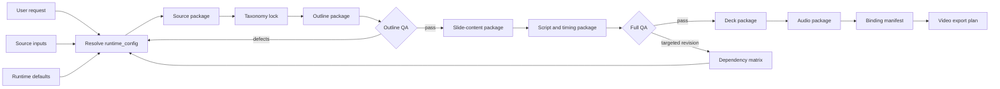

# Runtime Pipeline Map

## Variable flow

| Stage | Reads | Writes |
|---|---|---|
| 0 Resolve runtime | `user_request`, `source_inputs`, `runtime_defaults` | `runtime_config`, `unresolved_variables` |
| 1 Normalize sources | `sources.*`, `lesson.*` | source package, gap log, assumption log |
| 2 Lock taxonomy | `taxonomy.*`, source package | taxonomy package |
| 3 Build outline | taxonomy package, source package | outline package |
| 4 Outline QA | outline package, QA gates | outline defects |
| 5 Slide content | outline package, layout variables | slide-content package |
| 6 Script/timing | slide package, media variables | script package, timing package |
| 7 Full QA | all packages | QA log, release status |
| 8 Deck package | slide/script/layout packages | PPTX-ready manifest |
| 9 Audio package | `media.*`, script package | TTS queue, audio map |
| 10 Binding package | deck/audio packages | binding manifest |
| 11 Video package | binding package | video export plan |
| 12 Revision | revision variables, dependency matrix | targeted rebuild plan |
